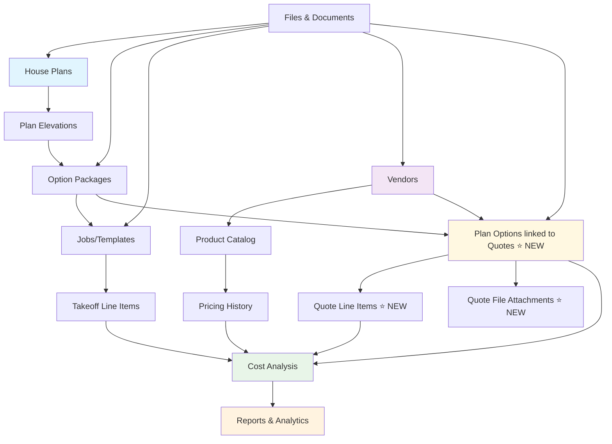

# Construction Takeoff Pricing System - User Guide

A comprehensive guide for estimators, project managers, and business users working with the construction takeoff pricing database system with enhanced vendor quote management.

## 📅 **Recent System Updates (June 28, 2025)**

✅ **IMPLEMENTED**: Quote-to-Product Integration - Automatic product creation from accepted quotes ⭐  
✅ **ENHANCED**: Item category linking in quotes enables seamless product catalog integration ⭐  
✅ **AUTOMATED**: Product generation with standardized naming when quotes are accepted ⭐  
✅ **CREATED**: Complete workflow from vendor quotes to product catalog population ⭐  
✅ **FIXED**: Quote creation system now fully operational - plan_option_id integration verified and working  
✅ **ENHANCED**: Plan option display format improved to show "Plan Full Name - Option Name" using proper SQL formatting  
✅ **VERIFIED**: Complete quote management workflow tested and functional  
✅ **IMPROVED**: Enhanced plan option relationships with proper foreign key integration  
✅ **TESTED**: Quote creation, editing, line item management, and file attachments all working correctly  
✅ **NEW**: Job Address Management - Complete address tracking for job site locations ⭐  
✅ **ADDED**: Address fields (street, city, state, zip, country) with automatic full address formatting  
✅ **ENHANCED**: Location-based search and filtering capabilities for better project tracking  

**Impact for Users:**
- **Quote creation forms** now work reliably without errors
- **Plan option dropdowns** show clear, descriptive names like "Winchester - Base Home Package"
- **Job filtering** works automatically based on selected plan options
- **File uploads** and attachments function properly for all quote documents
- **Quote workflows** are stable and ready for production use
- **Job location tracking** now available with complete address information ⭐
- **Address-based searching** allows finding jobs by city, state, or zip code ⭐
- **Automatic address formatting** provides professional display for reports ⭐

---

## 📋 Table of Contents

1. [What is This System?](#what-is-this-system)
2. [How Information is Organized](#how-information-is-organized)
3. [Getting Started](#getting-started)
4. [Accessing the System](#accessing-the-system)
5. [Understanding the Dashboard](#understanding-the-dashboard)
6. [Working with Data](#working-with-data)
7. [Quote Management System ⭐ NEW](#quote-management-system--new)
8. [Job Address Management ⭐ NEW](#job-address-management--new)
9. [Cost Analysis & Reports](#cost-analysis--reports)
10. [File Management](#file-management)
11. [Common Workflows](#common-workflows)
12. [Troubleshooting](#troubleshooting)
13. [Getting Help](#getting-help)

---

## 🏗️ What is This System?

The Construction Takeoff Pricing System is a comprehensive database that helps construction professionals manage and analyze costs across different house plans, elevations, and option packages. The system now includes a complete **vendor quote management workflow** with enhanced plan option integration.

### **What You Can Do With This System:**

✅ **View Cost Breakdowns** - See detailed costs for any house plan and elevation combination  
✅ **Compare Plans** - Analyze cost differences between different house designs  
✅ **Track Vendor Pricing** - Monitor material costs from different suppliers  
✅ **Manage Vendor Quotes** ⭐ **NEW** - Complete quote workflow with plan option integration  
✅ **Enhanced Plan Selection** ⭐ **NEW** - Plan options displayed as "Plan Name - Option Name"  
✅ **Manage Documentation** - Store and organize files related to projects and quotes  
✅ **Generate Reports** - Create cost analysis reports for decision making  
✅ **Historical Analysis** - Track how costs change over time  

### **Who Uses This System:**

- **Estimators** - Creating accurate cost estimates and managing vendor quotes
- **Project Managers** - Tracking costs and managing vendor relationships
- **Purchasing Teams** - Monitoring vendor pricing, managing quotes, and sourcing materials
- **Executives** - Analyzing cost trends and making strategic decisions

---

## 🗂️ How Information is Organized

Understanding how data flows through the system will help you navigate and use it more effectively.

### **Information Hierarchy**

```
Construction Company
│
├── House Plans (Winchester, Oxford, Calderwood, etc.)
│   │
│   ├── Elevations (A, B, C with Basement or Crawl foundation)
│   │   │
│   │   ├── Option Packages (Base Home, Design Options, Structural)
│   │   │   │
│   │   │   ├── Jobs/Templates (Pre-configured combinations)
│   │   │   │   │
│   │   │   │   └── Takeoff Line Items (Individual materials & costs)
│   │   │   │
│   │   │   └── Vendor Quotes ⭐ NEW (Quotes linked to specific plan options)
│   │   │   
│   │   └── Files & Documents (Plans, specifications, photos)
│   │
│   └── Cost Analysis (Automatic calculations and comparisons)
│
├── Vendor Catalog
│   ├── Vendor Information (Company details and contacts)
│   ├── Product Pricing (Current and historical prices)
│   ├── Vendor Quotes ⭐ NEW (Complete quote management workflow)
│   │   ├── Quote Details (Contact info, dates, status)
│   │   ├── Line Items (Detailed product pricing)
│   │   └── File Attachments (Quote documents, PDFs)
│   └── Supporting Documents (Catalogs, specifications)
│
└── Reporting & Analytics
    ├── Cost Comparisons (Plan vs. plan analysis)
    ├── Vendor Analysis (Price trends and performance)
    ├── Quote Analysis ⭐ NEW (Quote performance and tracking)
    └── Business Intelligence (Executive summaries)
```

### **Enhanced Data Relationship Diagram**



### **Key Concepts:**

**House Plans** → **Elevations** → **Options** → **Jobs** → **Line Items**
- Each house plan (like "Winchester") has multiple elevation options
- Each elevation can have different foundation types (basement vs crawl space)
- Each combination gets different option packages (base home, design options, etc.)
- Jobs are pre-configured templates with all the line items and costs

**Vendors** → **Products** → **Pricing** → **Quotes** ⭐ **Enhanced**
- Vendors supply various construction materials and services
- Each product has current pricing plus historical price changes
- **NEW**: Complete quote management with plan option integration
- **NEW**: Enhanced display showing "Plan Full Name - Option Name" format

---

## 🚀 Getting Started

### **System Requirements**

To use this system, you need:
- **Web browser** (Chrome, Firefox, Safari, Edge)
- **Network access** to the company's internal systems
- **Basic computer skills** (using web forms, uploading files)

### **System Access**

**Primary URL:** `http://127.0.0.1:8002` (or your company's server address)

**Key Sections:**
- **Dashboard:** `http://127.0.0.1:8002/` - Main system overview
- **Quote Management:** `http://127.0.0.1:8002/quotes` ⭐ **NEW**
- **New Quote Form:** `http://127.0.0.1:8002/quotes/new` ⭐ **NEW**
- **Table Browser:** `http://127.0.0.1:8002/table/[table_name]`

### **Quick Start Checklist**

- [ ] Verify you can access the web interface
- [ ] Browse the dashboard to see available data
- [ ] **NEW**: Navigate to Quote Management section
- [ ] **NEW**: Try creating a test quote with plan option selection
- [ ] Try viewing a simple table (like "vendors")
- [ ] Test the search functionality
- [ ] Upload a test file to understand the process
- [ ] Run a basic cost report
- [ ] Identify your primary use cases and workflows

---

## 🌐 Accessing the System

### **Web Interface Access**

The system is accessed through a web browser at `http://127.0.0.1:8002` (or your company's server address).

**Important Notes:**
- Currently, there is **no login required** - the system assumes you're on a trusted company network
- All users have full access to view, edit, and delete data
- Be careful when making changes as they affect everyone using the system

### **Navigation Structure**

**Main Dashboard** (`/`)
- System overview with table statistics
- Quick access to all major sections
- **NEW**: Direct link to Quote Management

**Quote Management Section** ⭐ **NEW** (`/quotes`)
- Complete quote listing and management
- Enhanced search and filtering capabilities
- Status tracking and vendor analysis

**Table Browser** (`/table/[table_name]`)
- Detailed view of any database table
- Search, filter, and edit capabilities
- Record creation and management

---

## 📊 Understanding the Dashboard

### **Enhanced Dashboard Elements**

#### **1. Table Statistics**
Shows the current state of your data including new quote tables:
```
Table Name          | Records | Description
--------------------|---------|----------------------------------
takeoffs           | 2,321   | Individual cost line items
vendor_quotes      | NEW     | ⭐ Vendor quote management
vendor_quote_lines | NEW     | ⭐ Quote line item details
file_attachments   | NEW     | ⭐ Quote document attachments
vendors            | 62      | Supplier companies
vendor_pricing     | 229     | Current material pricing
plans              | 6       | House plan designs
plan_elevations    | 7       | Elevation variations
plan_options       | 22      | ⭐ Enhanced with quote integration
jobs               | 21      | Pre-configured cost templates
```

#### **2. Enhanced Quick Navigation**
Click any table name or use the new direct links:
- **Quote Management** ⭐ **NEW** - Direct access to quote workflows
- **New Quote** ⭐ **NEW** - Quick quote creation
- **View all records** in any table
- **Search and filter** data
- **Add new records** (if you have permissions)
- **Export data** for analysis

#### **3. System Health**
Green indicators show:
- ✅ Database is running normally
- ✅ All connections are working
- ✅ Quote management system is operational ⭐ **NEW**
- ✅ Recent backups completed successfully

---

## 📋 Quote Management System ⭐ **NEW**

### **Overview**

The quote management system provides a complete workflow for managing vendor quotes with enhanced plan option integration. Plan options are now displayed in an easy-to-understand format: **"Plan Full Name - Option Name"** (e.g., "Croydonette - Basement Foundation").

### **Key Features**

#### **Enhanced Plan Option Selection**
- **Intelligent dropdown** showing "Plan Full Name - Option Name" format
- **Examples:** 
  - "Winchester - Base Home Package"
  - "Croydonette - Basement Foundation"
  - "Oxford - Design Options"
- **Automatic job filtering** based on selected plan option
- **Complete traceability** from quotes to specific plan configurations

#### **Complete Quote Workflow**
- **Vendor quote tracking** with all contact details
- **Line item management** with cost codes and descriptions
- **File attachment support** for quote documents
- **Status management** throughout quote lifecycle
- **Expiration tracking** and renewal alerts

### **Accessing Quote Management**

#### **Navigation Paths**
```
Dashboard → Quotes                     # Quote list view
Dashboard → New Quote                  # Quick quote creation
Quotes → [Quote Number]               # Quote details
Quote Details → Manage Line Items     # Line item management
Quote Details → Edit                  # Quote modification
```

#### **URLs for Direct Access**
- **Quote List:** `http://127.0.0.1:8002/quotes`
- **New Quote:** `http://127.0.0.1:8002/quotes/new`
- **Quote Details:** `http://127.0.0.1:8002/quotes/[quote_id]`
- **Edit Quote:** `http://127.0.0.1:8002/quotes/[quote_id]/edit`

### **Creating a New Quote**

#### **Step-by-Step Process**

**1. Navigate to New Quote Form**
- Click "Quotes" from dashboard
- Click "New Quote" button
- Or go directly to `/quotes/new`

**2. Select Vendor**
- Choose from existing vendor dropdown
- All active vendors are available
- Contact information will be automatically populated if available

**3. Choose Plan Option** ⭐ **Key Feature**
- Select from enhanced dropdown showing:
  - "Plan Full Name - Option Name" format
  - Example: "Croydonette - Basement Foundation"
  - Example: "Winchester - Design Options"
- This links the quote to specific plan configurations
- Jobs will automatically filter based on your selection

**4. Enter Quote Details**
- **Quote Number:** Auto-generated or manual entry
- **Quote Date:** Default to today's date
- **Expiration Date:** When quote expires
- **Contact Information:** Vendor representative details
- **Total Amount:** Quote value (can be calculated from line items)
- **Status:** Active, Expired, Accepted, Rejected, Superseded
- **Notes:** Additional information

**5. Upload Files** (Optional)
- **Supported formats:** PDF, Excel, Word, Images
- **File size limit:** 16MB maximum
- **Examples:** Quote PDFs, product catalogs, specifications
- Files are linked directly to the quote

**6. Save Options**
- **"Create Quote"** - Save quote and return to list
- **"Create & Add Line Items"** - Save and immediately add detailed pricing

#### **Enhanced Plan Option Display**

The system now shows plan options in a clear, descriptive format:

**Before:** Just option names like "Basement Foundation"
**Now:** Full context like "Croydonette - Basement Foundation"

**Benefits:**
- **Clear identification** of which plan each option belongs to
- **Logical sorting** by plan name then option name
- **Proper filtering** of related jobs and takeoff data
- **Better traceability** from quotes to specific plan configurations

### **Managing Quote Line Items**

#### **Adding Line Items**
**Navigation:** Quote Details → "Manage Line Items"

**Process:**
1. **Cost Code:** Enter standard cost category
2. **Product Description:** Detailed item description
3. **Quantity:** Number of units needed
4. **Unit Price:** Price per unit
5. **Unit of Measure:** EA, SF, LF, etc.
6. **Line Total:** Automatically calculated (quantity × unit price)
7. **Product Linking:** Link to existing products for consistency
8. **Notes:** Additional item information

#### **Line Item Features**
- **Automatic calculations** for line totals
- **Product catalog integration** for consistency
- **Cost code standardization** for reporting
- **Edit and delete** capabilities with confirmation
- **Quote total updates** as line items change

### **Quote Status Management**

#### **Available Statuses**
- **Active** - Quote is current and valid for acceptance
- **Expired** - Quote has passed its expiration date
- **Accepted** - Quote has been selected for the project
- **Rejected** - Quote was not selected
- **Superseded** - Replaced by a newer quote version

#### **Status Workflow**
```
Active → [Decision Point] → Accepted/Rejected/Expired
Active → [New Version] → Superseded
Expired → [Renewal] → Active (new quote)
```

### **Quote Analysis and Reporting**

#### **Quote List Features**
- **Search by:** Quote number, vendor name, plan option
- **Filter by:** Status, date range, vendor
- **Sort by:** Date, amount, vendor, status
- **Summary statistics:** Total quotes, values, vendor counts

#### **Performance Tracking**
- **Vendor quote success rates** (accepted vs. total quotes)
- **Plan option quote distribution** (most quoted plans)
- **Quote value analysis** and trends over time
- **Expiration monitoring** for proactive renewal

---

## 🏠 Job Address Management ⭐ **NEW**

### **Overview**

The Job Address Management system provides complete address tracking for construction job sites. This new feature allows you to store and manage detailed location information for each job, enabling better project organization, location-based reporting, and professional documentation.

### **Key Features**

#### **Complete Address Storage**
- **Street Address** - Primary street number and name
- **Address Line 2** - Optional secondary address (suite, apartment, unit number)
- **City** - City or town name
- **State** - State or province abbreviation
- **ZIP Code** - Postal/ZIP code
- **Country** - Country name (defaults to "USA")

#### **Automatic Address Formatting**
- **Full Address Display** - Automatically combines all fields into professional format
- **Examples:**
  - "123 Main Street, Austin, TX 78701"
  - "456 Oak Avenue Suite 200, Dallas, TX 75201"
  - "789 Pine Road Apt 15, Houston, TX 77002"

#### **Location-Based Search and Filtering**
- **Search by City** - Find all jobs in specific cities
- **Search by State** - Filter jobs by state or region
- **Search by ZIP Code** - Locate jobs in specific postal areas
- **Combined Searches** - Use multiple criteria for precise filtering

### **Accessing Job Address Information**

#### **Navigation Paths**
```
Dashboard → Jobs Table → Job Details         # View job addresses
Dashboard → Jobs Table → Edit Job           # Add/edit addresses
Dashboard → Jobs Table → New Job            # Add address during creation
```

#### **Direct Access URLs**
- **Jobs Table:** `http://127.0.0.1:8002/table/jobs`
- **Job Details:** `http://127.0.0.1:8002/table/jobs/record/[job_id]`
- **Edit Job:** `http://127.0.0.1:8002/table/jobs/edit/[job_id]`

### **Adding and Managing Job Addresses**

#### **Adding Address to New Job**

**Step-by-Step Process:**
1. **Navigate to New Job Form**
   - Go to Dashboard → Jobs Table → "New Record"
   - Or access directly at `/table/jobs/new`

2. **Enter Basic Job Information**
   - Job Name (required)
   - Plan Option Selection
   - Job Number and Customer Name
   - Template status if applicable

3. **Add Address Information** ⭐ **New Fields**
   - **Street Address:** Enter street number and name
     - Example: "123 Main Street"
   - **Address Line 2:** Add unit/suite if needed (optional)
     - Example: "Suite 200", "Apt 15", "Unit B"
   - **City:** Enter city or town name
     - Example: "Austin", "Dallas", "Houston"
   - **State:** Enter state abbreviation
     - Example: "TX", "CA", "FL"
   - **ZIP Code:** Enter postal code
     - Example: "78701", "75201", "90210"
   - **Country:** Leave as "USA" or change if international

4. **Save Job**
   - Click "Create Record" to save with address
   - Address will be automatically formatted and displayed

#### **Editing Existing Job Addresses**

**For jobs without addresses:**
1. **Navigate to Job** you want to update
2. **Click "Edit"** from job details page
3. **Scroll to Address Fields** (newly available)
4. **Enter address information** as described above
5. **Save changes** - address will be immediately available

**For jobs with existing addresses:**
1. **View current address** in job details
2. **Edit any field** that needs updating
3. **Save changes** - formatted address updates automatically

### **Using Address Information for Business Operations**

#### **Location-Based Job Management**

**Finding Jobs by Location:**
```
Search Examples:
"Austin"           - Find all jobs in Austin
"TX"              - Find all jobs in Texas
"78701"           - Find jobs in specific ZIP code
"Main Street"     - Find jobs on Main Street
"Suite"           - Find jobs with suite numbers
```

**Geographic Reporting:**
- **Jobs by City** - Count and analyze jobs per city
- **Regional Analysis** - Group jobs by state or region
- **ZIP Code Clustering** - Identify job concentration areas
- **Route Planning** - Organize site visits by location

#### **Professional Documentation and Reports**

**Address Usage in Reports:**
- **Job Summaries** - Include full formatted address
- **Client Communications** - Professional address display
- **Work Orders** - Complete job site location details
- **Vendor Coordination** - Precise delivery and service locations

**Address Display Format:**
```
Job: Winchester Model Home
Location: 123 Main Street, Austin, TX 78701
Plan: Winchester - Basement Foundation
Customer: Smith Family
```

#### **Integration with Existing Workflows**

**Quote Management Integration:**
- **Quote-to-Address Linking** - Connect vendor quotes to specific job addresses
- **Location-Based Vendor Selection** - Choose vendors by proximity to job sites
- **Delivery Coordination** - Use addresses for material delivery planning

**Cost Analysis by Location:**
- **Regional Cost Variations** - Compare costs between different cities/states
- **Transportation Costs** - Factor location into total project costs
- **Local Vendor Preferences** - Analyze vendor performance by region

### **Address Data Quality and Best Practices**

#### **Data Entry Standards**

**Address Formatting Guidelines:**
```
Street Address Examples:
✅ Good: "123 Main Street"
✅ Good: "456 Oak Avenue"
✅ Good: "789 Pine Road"
❌ Avoid: "123 main st" (inconsistent capitalization)
❌ Avoid: "456 Oak Ave Unit 200" (put unit info in Address Line 2)

Address Line 2 Examples:
✅ Good: "Suite 200"
✅ Good: "Apt 15"
✅ Good: "Unit B"
✅ Good: "Building 3"
❌ Avoid: "Ste 200" (use full words when possible)

City Examples:
✅ Good: "Austin"
✅ Good: "San Antonio"
✅ Good: "New York"
❌ Avoid: "austin" (use proper capitalization)

State Examples:
✅ Good: "TX"
✅ Good: "CA"
✅ Good: "NY"
❌ Avoid: "Texas" (use abbreviations)
❌ Avoid: "tx" (use uppercase)

ZIP Code Examples:
✅ Good: "78701"
✅ Good: "78701-1234" (with extension)
❌ Avoid: "78701 1234" (no spaces)
```

#### **Address Validation Tips**

**Before Saving:**
- **Verify ZIP codes** match the city and state
- **Check spelling** of street names and cities
- **Use standard abbreviations** for states (TX, CA, NY, etc.)
- **Include apartment/suite numbers** in Address Line 2, not Street Address
- **Use consistent formatting** across all job addresses

**Address Verification Resources:**
- **USPS Address Lookup** - Verify addresses online
- **Google Maps** - Confirm address accuracy
- **Local Building Permits** - Cross-reference with official records

### **Troubleshooting Address Issues**

#### **Common Address Problems**

**Problem: Address Not Displaying in Full Format**
**Solutions:**
1. **Check all required fields** are filled (street, city, state, ZIP)
2. **Refresh the page** to reload formatted address
3. **Verify data entry** - no special characters or formatting issues

**Problem: Cannot Find Jobs by Address Search**
**Solutions:**
1. **Use partial searches** - try "Main" instead of "Main Street"
2. **Check spelling** of search terms
3. **Try different search approaches** - city name, ZIP code, etc.

**Problem: Address Fields Not Visible**
**Solutions:**
1. **Update your browser** and clear cache
2. **Check you're viewing the correct job record**
3. **Verify system has been updated** with address functionality

**When to Escalate:** Contact system administrator if address fields are completely missing or if data is consistently not saving.

### **Advanced Address Features (Future Enhancements)**

#### **Planned Address Integrations**
- **Mapping Integration** - Display job locations on interactive maps
- **GPS Coordinates** - Store precise latitude/longitude coordinates
- **Distance Calculations** - Calculate distances between jobs and vendors
- **Route Optimization** - Plan efficient site visit routes
- **Address Verification** - Automatic address validation and standardization

#### **Reporting Enhancements**
- **Geographic Reports** - Visual maps of job distributions
- **Regional Analysis** - Automated regional cost and performance analysis
- **Vendor Proximity Analysis** - Match vendors to nearby job sites
- **Territory Management** - Organize jobs by sales territories or service areas

---

## 💼 Working with Data

### **Enhanced Data Navigation**

#### **Table Browsing with Quote Integration**
1. **Click** on any table name from the dashboard
2. **NEW**: Direct access to quote-related tables
3. **Browse** records using pagination controls
4. **Sort** columns including new quote fields
5. **Search** across quote data (vendor names, plan options, etc.)

#### **Quote-Specific Record Views**
1. **Quote Details** show complete information including:
   - Vendor information with contact details
   - **Plan option display** in "Plan Full Name - Option Name" format
   - Line item summaries with totals
   - File attachment listings
   - Status and date tracking

### **Enhanced Search Capabilities**

#### **Quote Search Examples**
```
"Winchester"           - Finds quotes for Winchester plans
"Basement Foundation"  - Finds quotes for basement foundation options
"Acme Company"        - Finds all quotes from Acme vendor
"Active"              - Finds all active quotes
"$50000"              - Finds quotes around $50,000
"2024-12"             - Finds quotes from December 2024
```

#### **Plan Option Search**
With the enhanced plan option integration, you can search for:
- **Plan names:** "Winchester", "Croydonette", "Oxford"
- **Option types:** "Base Home", "Design Options", "Structural"
- **Foundation types:** "Basement", "Crawl"
- **Combined terms:** "Winchester Basement" finds Winchester basement options

### **Data Relationships and Navigation**

#### **Quote-to-Plan Integration**
- **From Quote:** Click plan option to see related plans and jobs
- **From Plan:** See all quotes associated with plan options
- **From Vendor:** View all quotes from specific vendors
- **From Job:** See related quotes for the same plan configuration

#### **File Attachment Navigation**
- **From Quote:** View all attached documents
- **From File List:** See which quotes files are attached to
- **Download capabilities:** Direct file access with original names
- **Upload tracking:** See when files were added and by whom

---

## 📈 Cost Analysis & Reports

### **Enhanced Cost Analysis with Quote Data**

#### **Quote vs. Takeoff Comparison** ⭐ **NEW**
**Purpose:** Compare vendor quotes with internal takeoff estimates

**Process:**
1. **Navigate** to specific plan option in takeoffs table
2. **Note** the takeoff cost totals for plan configuration
3. **Go to** quote management for same plan option
4. **Compare** quoted prices with takeoff estimates
5. **Identify** variances and cost-saving opportunities

**Sample Analysis:**
```
Plan Configuration    | Takeoff Cost | Quoted Cost | Variance | Notes
---------------------|-------------|-------------|----------|----------------
Winchester-Basement  | $185,420    | $178,950    | -$6,470  | Quote is lower
Oxford-Design Options| $15,200     | $17,800     | +$2,600  | Quote is higher
Croydonette-Base     | $175,300    | $175,300    | $0       | Exact match
```

#### **Vendor Quote Performance Analysis** ⭐ **NEW**
**Purpose:** Analyze vendor pricing patterns and success rates

**Steps:**
1. **Access** quote management section
2. **Filter** by vendor or date range
3. **Export** quote data to Excel
4. **Analyze** patterns in vendor pricing
5. **Calculate** acceptance rates and average values

**Key Metrics:**
- **Quote acceptance rate** by vendor
- **Average quote value** trends over time
- **Price competitiveness** compared to other vendors
- **Quote turnaround time** and responsiveness

#### **Plan Option Quote Distribution** ⭐ **NEW**
**Purpose:** Understand which plan options are most commonly quoted

**Analysis Questions:**
- Which plan options receive the most quotes?
- What's the average quote value by plan type?
- How do foundation types (basement vs. crawl) affect pricing?
- Which option packages (base vs. design) have more pricing variability?

### **Enhanced Reporting Capabilities**

#### **Quote Summary Reports**
**Navigation:** Quotes → Export or Dashboard → Quote Analytics

**Available Reports:**
- **Quote Status Summary** - Active, expired, accepted counts
- **Vendor Performance** - Success rates and average values
- **Plan Option Analysis** - Quote distribution by plan type
- **Monthly Quote Trends** - Volume and value patterns over time

#### **Integration with Existing Reports**

**Plan Comparison with Quote Data:**
```sql
-- Example analysis combining takeoffs and quotes
SELECT 
    plan_full_name,
    option_name,
    AVG(takeoff_total) as avg_takeoff_cost,
    AVG(quote_total) as avg_quoted_cost,
    COUNT(quotes) as quote_count
FROM combined_plan_data
GROUP BY plan_full_name, option_name
ORDER BY quote_count DESC;
```

**Vendor Analysis Enhanced:**
- **Historical pricing** from vendor_pricing table
- **Current quotes** from quote management
- **Acceptance patterns** and vendor relationships
- **Cost trends** and market analysis

---

## 📁 File Management

### **Enhanced File Management with Quote Integration**

#### **Quote File Attachments** ⭐ **NEW**
The system now supports direct file attachments to quotes, expanding beyond the general file system.

**Quote-Specific File Types:**
- **Quote Documents:** PDF quotes from vendors
- **Product Catalogs:** Vendor material specifications
- **Pricing Sheets:** Detailed pricing breakdowns
- **Correspondence:** Email attachments and communications
- **Proposals:** Formal vendor proposals and presentations

#### **File Organization Structure**

```
File System Organization:
├── General Project Files
│   ├── Plan Documents (linked to plans and jobs)
│   ├── Vendor Catalogs (linked to vendors)
│   └── Product Specifications (linked to items)
│
└── Quote File Attachments ⭐ NEW
    ├── Quote PDFs (vendor-provided quotes)
    ├── Supporting Documents (catalogs, specs)
    ├── Correspondence (emails, letters)
    └── Analysis Files (comparisons, summaries)
```

#### **Uploading Files to Quotes**

**During Quote Creation:**
1. **Navigate** to new quote form (`/quotes/new`)
2. **Scroll** to "Quote Attachments" section
3. **Select** files using "Choose Files" button
4. **Add** descriptions for each file (recommended)
5. **Save** quote - files are automatically linked

**After Quote Creation:**
1. **Go to** quote details page
2. **Click** "Manage Attachments" or "Upload Files"
3. **Select** and upload additional files
4. **Files** are immediately available for download

#### **File Access and Downloads**

**From Quote View:**
- **File list** shows all attachments with names and upload dates
- **Click filename** to download with original name
- **File size** and type information displayed
- **Upload date** and user tracking (future enhancement)

**File Security:**
- **Secure storage** with unique identifiers
- **Access control** follows quote permissions
- **Original filename preservation** for downloads
- **File type validation** and size limits (16MB max)

### **Best Practices for Quote File Management**

#### **File Naming Conventions**
```
Quote Documents:
VendorName_QuoteNumber_YYYY-MM-DD.pdf
Example: AcmeCorp_Q2024-001_2024-12-27.pdf

Supporting Documents:
VendorName_ProductCatalog_YYYY.pdf
VendorName_PriceList_YYYY-MM.xlsx

Correspondence:
VendorName_Email_YYYY-MM-DD.pdf
VendorName_Proposal_ProjectName_YYYY-MM-DD.pdf
```

#### **File Organization Tips**
- **Use descriptive names** that include vendor, date, and type
- **Add file descriptions** in the upload form
- **Keep file sizes reasonable** (under 16MB)
- **Upload supporting documents** that provide context
- **Organize by quote status** for easy access

---

## 🔄 Common Workflows

### **Enhanced Workflows with Quote Management**

### **Workflow 1: Complete Quote-to-Project Process** ⭐ **NEW**

**Scenario:** Managing a vendor quote from receipt through project award.

**Steps:**
1. **Receive Quote** from vendor (email, mail, or phone)
2. **Create Quote Record:**
   - Navigate to `/quotes/new`
   - Select vendor from dropdown
   - **Choose plan option** using "Plan Full Name - Option Name" format
   - Enter quote details (number, dates, contact info)
   - Upload quote PDF and supporting documents
   - Set status to "Active"

3. **Add Line Items:**
   - Click "Create & Add Line Items" or navigate to line items later
   - Enter detailed cost codes and descriptions
   - Link to existing products where possible
   - Verify quantities and pricing
   - Review calculated totals

4. **Compare with Takeoffs:**
   - Navigate to related plan option takeoffs
   - Compare quote pricing with internal estimates
   - Identify variances and investigate discrepancies
   - Document findings in quote notes

5. **Decision and Award:**
   - Update quote status based on decision
   - If accepted: Status = "Accepted", update notes
   - If rejected: Status = "Rejected", document reasons
   - If superseded: Status = "Superseded", link to new quote

6. **Follow-up Actions:**
   - Export accepted quotes for purchasing
   - Update vendor pricing catalog with accepted rates
   - File supporting documents for future reference

**Expected Result:** Complete quote lifecycle management with full traceability.

### **Workflow 2: Plan Option Cost Analysis with Quotes** ⭐ **NEW**

**Scenario:** Analyzing all available pricing for a specific plan option.

**Steps:**
1. **Identify Plan Option:**
   - Determine specific plan configuration (e.g., "Winchester - Basement Foundation")
   - Note plan option ID for reference

2. **Gather Takeoff Data:**
   - Navigate to takeoffs table
   - Filter by plan option or related job
   - Export takeoff line items and totals
   - Calculate internal cost estimate

3. **Review Quote History:**
   - Go to quote management (`/quotes`)
   - Filter by plan option or search for plan name
   - Review all quotes for this configuration
   - Note quote dates, vendors, and amounts

4. **Analyze Pricing Patterns:**
   - Compare takeoff vs. quoted costs
   - Identify lowest and highest vendor quotes
   - Look for pricing trends over time
   - Calculate average quoted cost

5. **Create Pricing Report:**
   - Export quote data to Excel
   - Create comparison spreadsheet with:
     - Internal takeoff cost
     - All vendor quotes with dates
     - Variance analysis
     - Recommendations for future sourcing

**Expected Result:** Comprehensive pricing analysis for informed decision-making.

### **Workflow 3: Vendor Performance Review with Quote Data** ⭐ **NEW**

**Scenario:** Quarterly vendor performance evaluation using quote history.

**Steps:**
1. **Gather Quote Data:**
   - Access quote management system
   - Filter by date range (quarterly)
   - Export all quote data for analysis period
   - Include status, amounts, and response times

2. **Analyze Vendor Metrics:**
   - **Quote volume:** Number of quotes requested vs. received
   - **Response time:** Days from request to quote receipt
   - **Success rate:** Accepted vs. total quotes percentage
   - **Price competitiveness:** Ranking against other vendors
   - **Quote quality:** Completeness and accuracy

3. **Review Supporting Data:**
   - Check file attachments for quote quality
   - Review line item detail and accuracy
   - Assess vendor communication and responsiveness
   - Evaluate contract terms and conditions

4. **Prepare Performance Report:**
   - **Quantitative metrics:** Response time, success rate, volume
   - **Qualitative assessment:** Communication, quality, reliability
   - **Trend analysis:** Improvement or decline over time
   - **Recommendations:** Continue, develop, or discontinue relationship

5. **Vendor Meetings and Feedback:**
   - Schedule meetings with key vendors
   - Share performance feedback and expectations
   - Negotiate improved terms or pricing
   - Document agreements and follow-up actions

**Expected Result:** Data-driven vendor performance management and relationship optimization.

### **Workflow 4: Quote Expiration Management** ⭐ **NEW**

**Scenario:** Proactive management of quote expirations and renewals.

**Monthly Tasks:**
1. **Review Expiring Quotes:**
   - Filter quotes by expiration date (next 30-60 days)
   - Identify critical quotes for active projects
   - Prioritize renewal requests based on project needs

2. **Vendor Communication:**
   - Contact vendors for quote extensions or renewals
   - Request updated pricing for expired quotes
   - Negotiate extended validity periods

3. **Status Updates:**
   - Update expired quotes to "Expired" status
   - Create new quote records for renewals
   - Link superseded quotes to new versions

4. **Documentation:**
   - Upload renewed quotes and correspondence
   - Update notes with negotiation outcomes
   - Maintain audit trail of quote evolution

**Expected Result:** Proactive quote management preventing project delays.

### **Workflow 5: Integrated Monthly Data Maintenance** ⭐ **ENHANCED**

**Scenario:** Regular system maintenance including new quote data.

**Monthly Tasks:**
1. **Quote Data Review:**
   - Review recently created quotes for accuracy
   - Verify plan option links are correct
   - Check file attachments are accessible
   - Confirm vendor information is current

2. **Status Management:**
   - Update quote statuses based on project decisions
   - Mark expired quotes appropriately
   - Link related quotes (superseded relationships)

3. **Data Quality Checks:**
   - Verify plan option display formats are correct
   - Check for duplicate quote entries
   - Validate vendor pricing integration
   - Review line item calculations

4. **File Management:**
   - Archive old quote documents as needed
   - Verify file attachments are accessible
   - Clean up incomplete upload attempts
   - Backup critical quote documents

5. **Reporting and Analysis:**
   - Generate monthly quote summary reports
   - Update vendor performance metrics
   - Analyze plan option quote trends
   - Report system issues or improvement needs

**Expected Result:** Clean, accurate, and up-to-date system with reliable quote management.

---

## ❗ Troubleshooting

### **Enhanced Troubleshooting with Quote Management**

#### **Quote-Specific Issues**

#### **Problem: Plan Options Not Displaying Correctly**
**Symptoms:** Plan options show only option names, not "Plan Full Name - Option Name" format

**Solutions:**
1. **Refresh** the page to reload plan option data
2. **Check** if plan elevation data is complete
3. **Verify** the plan option query is working:
   - Navigate to plan_options table
   - Confirm plan_elevation_id links are valid
   - Check that plan_full_name field is populated
4. **Clear** browser cache and reload
5. **Contact** system administrator if problem persists

**When to Escalate:** If plan option display is consistently wrong across users

#### **Problem: Cannot Create Quotes with Plan Options**
**Symptoms:** Quote creation fails, plan option dropdown is empty, form errors

**Solutions:**
1. **Verify** plan option data exists:
   - Navigate to plan_options table in dashboard
   - Confirm records are present and complete
   - Check plan_elevations table for proper relationships
2. **Check** vendor data is complete:
   - Verify vendor records exist and are active
   - Confirm vendor dropdown populates correctly
3. **Test** with simplified data:
   - Try creating quote without plan option first
   - Add plan option after quote creation if needed
4. **Review** form validation:
   - Check for required field errors
   - Verify date formats are correct (YYYY-MM-DD)

**When to Escalate:** If quote creation consistently fails for all users

#### **Problem: Quote File Uploads Failing**
**Symptoms:** File uploads fail, error messages, files not appearing in quote

**Solutions:**
1. **Check File Requirements:**
   - File size under 16MB
   - Supported formats: PDF, Excel, Word, Images
   - Remove special characters from filename
2. **Browser Issues:**
   - Try different browser
   - Clear browser cache and cookies
   - Disable browser extensions temporarily
3. **Network Issues:**
   - Check internet connection stability
   - Try smaller files first
   - Upload one file at a time
4. **System Storage:**
   - Contact IT about available disk space
   - Check if upload directory is accessible

**When to Escalate:** If file uploads fail consistently across all users and file types

#### **Problem: Quote Line Item Calculations Wrong**
**Symptoms:** Line totals don't match quantity × unit price, quote totals incorrect

**Solutions:**
1. **Manual Verification:**
   - Check calculations manually
   - Verify quantity and unit price data types
   - Look for hidden characters or formatting issues
2. **Data Entry Issues:**
   - Re-enter problematic line items
   - Use decimal format for numbers (e.g., 1250.00 not 1,250)
   - Avoid currency symbols in number fields
3. **Browser Display Issues:**
   - Refresh page to reload calculations
   - Clear browser cache
   - Try different browser
4. **Database Issues:**
   - Check if other users see same calculations
   - Verify database triggers are working correctly

**When to Escalate:** If calculations are consistently wrong across multiple quotes

### **Enhanced Performance Issues**

#### **Quote Management Running Slowly**
**
